# 🔑 Cykl Życia Tokenów JWT

> **Szczegółowy opis cyklu życia tokenów JWT i procesu ich odświeżania w systemie QuizApp**

## 📋 Spis Treści

- [Przegląd Systemu Tokenów](#przegląd-systemu-tokenów)
- [Konfiguracja Tokenów](#konfiguracja-tokenów)
- [Proces Logowania](#proces-logowania)
- [Struktura Tokenów](#struktura-tokenów)
- [Wykorzystanie Access Token](#wykorzystanie-access-token)
- [Proces Odświeżania Tokenów](#proces-odświeżania-tokenów)
- [Proces Wylogowania](#proces-wylogowania)
- [Zabezpieczenia](#zabezpieczenia)
- [Implementacja Techniczna](#implementacja-techniczna)

---

## 🔍 Przegląd Systemu Tokenów

System QuizApp implementuje **dwutokenowy mechanizm uwierzytelnienia** składający się z:

### Access Token (JWT)
- **Typ**: JSON Web Token (JWT)
- **Czas życia**: 24 godziny
- **Zastosowanie**: Autoryzacja API calls
- **Przechowywanie**: Tylko w pamięci klienta

### Refresh Token
- **Typ**: UUID string
- **Czas życia**: 7 dni
- **Zastosowanie**: Odświeżanie Access Token
- **Przechowywanie**: Baza danych + klient

---

## ⚙️ Konfiguracja Tokenów

```ini
# Czas życia Access Token: 24 godziny (86400000 ms)
app.jwt.expiration=86400000

# Czas życia Refresh Token: 7 dni (604800000 ms)  
app.jwt.refresh-expiration=604800000

# Klucz do podpisywania tokenów (256-bit)
app.jwt.secret=MIkolajKrawczakJWTSecretKey2025SuperBezpiecznyKluczDoTokenowMinimum256BitowKryptograficzny
```

**Lokalizacja konfiguracji:**
- `user-service/src/main/resources/application.properties`
- Replikacja w innych serwisach dla walidacji

---

## 🔐 Proces Logowania

### 1. Sekwencja Logowania


### 2. Implementacja Logowania

```java
public JwtResponse authenticateUser(LoginRequest loginRequest) {
    // 1. Uwierzytelnienie użytkownika
    Authentication authentication = authenticationManager.authenticate(
        new UsernamePasswordAuthenticationToken(
            loginRequest.getUsername(), 
            loginRequest.getPassword()
        ));

    // 2. Generowanie Access Token (JWT)
    String jwt = jwtTokenProvider.generateJwtToken(authentication);
    
    UserPrincipal userDetails = (UserPrincipal) authentication.getPrincipal();
    List<String> roles = userDetails.getAuthorities().stream()
            .map(item -> item.getAuthority())
            .collect(Collectors.toList());
    
    // 3. Tworzenie Refresh Token
    RefreshToken refreshToken = refreshTokenService.createRefreshToken(userDetails.getId());

    // 4. Zwrócenie obu tokenów
    return new JwtResponse(jwt, refreshToken.getToken(), userDetails.getId(), 
                          userDetails.getUsername(), userDetails.getEmail(), roles);
}
```

### 3. Odpowiedź Logowania

```json
{
  "token": "eyJhbGciOiJIUzUxMiJ9.eyJzdWIiOiJ1c2VyMSIsImlhdCI6MTY0...",
  "refreshToken": "123e4567-e89b-12d3-a456-426614174000",
  "type": "Bearer",
  "id": 1,
  "username": "user1",
  "email": "user1@example.com",
  "roles": ["ROLE_USER"]
}
```

---

## 🏗️ Struktura Tokenów

### Access Token (JWT)

```java
public String generateJwtToken(Authentication authentication) {
    UserPrincipal userPrincipal = (UserPrincipal) authentication.getPrincipal();
    
    return Jwts.builder()
        .setSubject(userPrincipal.getUsername())    // Username
        .setIssuedAt(new Date())                    // Data utworzenia
        .setExpiration(new Date(System.currentTimeMillis() + jwtExpirationMs)) // 24h
        .signWith(getSigningKey(), SignatureAlgorithm.HS512)            // Podpis
        .compact();
}
```

**Struktura JWT:**
```
Header: {
  "alg": "HS512",
  "typ": "JWT"
}

Payload: {
  "sub": "username",
  "iat": 1641234567,
  "exp": 1641320967
}

Signature: HMACSHA512(
  base64UrlEncode(header) + "." + base64UrlEncode(payload),
  secret
)
```

### Refresh Token

```java
public RefreshToken createRefreshToken(Long userId) {
    RefreshToken refreshToken = new RefreshToken();
    
    User user = userRepository.findById(userId)
        .orElseThrow(() -> new RuntimeException("Nie znaleziono użytkownika"));

    // 1. Usunięcie starych refresh tokenów (one-to-one relation)
    refreshTokenRepository.findAll().stream()
        .filter(token -> token.getUser().getId().equals(userId))
        .forEach(refreshTokenRepository::delete);

    // 2. Tworzenie nowego tokenu
    refreshToken.setUser(user);
    refreshToken.setToken(UUID.randomUUID().toString());  // Random UUID
    refreshToken.setExpiresAt(Instant.now().plusMillis(refreshTokenDurationMs)); // 7 dni
    refreshToken.setCreatedAt(Instant.now());
    
    return refreshTokenRepository.save(refreshToken);
}
```

**Encja Refresh Token:**
```java
@Entity
@Table(name = "refresh_tokens")
public class RefreshToken {
    @Id
    @GeneratedValue(strategy = GenerationType.IDENTITY)
    private Long id;

    @OneToOne
    @JoinColumn(name = "user_id", referencedColumnName = "id")
    private User user;

    @Column(nullable = false, unique = true)
    private String token;  // UUID string

    @Column(nullable = false, name = "expires_at")
    private Instant expiresAt;

    @Column(name = "created_at")
    private Instant createdAt;
}
```

---

## 🌐 Wykorzystanie Access Token

### 1. Proces Autoryzacji API


### 2. Implementacja JWT Filter

```java
@Component
public class JwtAuthenticationFilter extends OncePerRequestFilter {
    
    @Override
    protected void doFilterInternal(HttpServletRequest request, 
                                  HttpServletResponse response, 
                                  FilterChain filterChain) throws ServletException, IOException {
        try {
            String jwt = parseJwt(request);
            if (jwt != null && jwtTokenProvider.validateJwtToken(jwt)) {
                String username = jwtTokenProvider.getUsernameFromJwtToken(jwt);

                UserDetails userDetails = userDetailsService.loadUserByUsername(username);
                UsernamePasswordAuthenticationToken authentication = 
                    new UsernamePasswordAuthenticationToken(userDetails, null, 
                                                           userDetails.getAuthorities());
                authentication.setDetails(new WebAuthenticationDetailsSource().buildDetails(request));

                SecurityContextHolder.getContext().setAuthentication(authentication);
            }
        } catch (Exception e) {
            logger.error("Cannot set user authentication: {}", e);
        }

        filterChain.doFilter(request, response);
    }

    private String parseJwt(HttpServletRequest request) {
        String headerAuth = request.getHeader("Authorization");
        if (StringUtils.hasText(headerAuth) && headerAuth.startsWith("Bearer ")) {
            return headerAuth.substring(7);
        }
        return null;
    }
}
```

### 3. Walidacja Token

```java
public boolean validateJwtToken(String authToken) {
    try {
        Jwts.parserBuilder()
                .setSigningKey(getSigningKey())
                .build()
                .parseClaimsJws(authToken);
        return true;
    } catch (MalformedJwtException e) {
        log.error("Nieprawidłowy token JWT: {}", e.getMessage());
    } catch (ExpiredJwtException e) {
        log.error("Token JWT wygasł: {}", e.getMessage());
    } catch (UnsupportedJwtException e) {
        log.error("Token JWT nie jest obsługiwany: {}", e.getMessage());
    } catch (IllegalArgumentException e) {
        log.error("Pusty ciąg JWT: {}", e.getMessage());
    }
    return false;
}
```

---

## 🔄 Proces Odświeżania Tokenów

### 1. Sekwencja Odświeżania


### 2. Implementacja Odświeżania

```java
public TokenRefreshResponse refreshToken(TokenRefreshRequest request) {
    String requestRefreshToken = request.getRefreshToken();

    return refreshTokenService.findByToken(requestRefreshToken)
        .map(refreshTokenService::verifyExpiration)  // Sprawdź wygaśnięcie
        .map(RefreshToken::getUser)                   // Pobierz użytkownika
        .map(user -> {
            // Wygeneruj nowy Access Token
            Authentication auth = new UsernamePasswordAuthenticationToken(
                user.getUsername(), null, UserPrincipal.build(user).getAuthorities());
            String newToken = jwtTokenProvider.generateJwtToken(auth);
            
            return new TokenRefreshResponse(newToken, requestRefreshToken);
        })
        .orElseThrow(() -> new TokenRefreshException(requestRefreshToken,
            "Token odświeżający nie znajduje się w bazie danych!"));
}
```

### 3. Weryfikacja Wygaśnięcia

```java
public RefreshToken verifyExpiration(RefreshToken token) {
    if (token.getExpiresAt().compareTo(Instant.now()) < 0) {
        // Token wygasł - usuń z bazy
        refreshTokenRepository.delete(token);
        throw new TokenRefreshException(token.getToken(), 
            "Token odświeżający wygasł. Zaloguj się ponownie.");
    }
    return token;
}
```

### 4. Klient - Automatyczne Odświeżanie

```javascript
// Frontend - Axios Interceptor
axios.interceptors.response.use(
  (response) => response,
  async (error) => {
    const originalRequest = error.config;
    
    if (error.response?.status === 401 && !originalRequest._retry) {
      originalRequest._retry = true;
      
      try {
        const refreshToken = localStorage.getItem('refreshToken');
        const response = await axios.post('/api/auth/refresh-token', {
          refreshToken: refreshToken
        });
        
        const { accessToken } = response.data;
        localStorage.setItem('accessToken', accessToken);
        
        // Ponów pierwotne żądanie z nowym tokenem
        originalRequest.headers.Authorization = `Bearer ${accessToken}`;
        return axios(originalRequest);
        
      } catch (refreshError) {
        // Refresh token wygasł - przekieruj na logowanie
        localStorage.removeItem('accessToken');
        localStorage.removeItem('refreshToken');
        window.location.href = '/login';
        return Promise.reject(refreshError);
      }
    }
    
    return Promise.reject(error);
  }
);
```

---

## 🚪 Proces Wylogowania

### 1. Sekwencja Wylogowania

```mermaid
sequenceDiagram
    participant Client
    participant AuthController
    participant RefreshTokenService
    participant Database

    Client->>AuthController: POST /api/auth/logout<br/>{refreshToken}
    AuthController->>RefreshTokenService: logoutUser()
    RefreshTokenService->>Database: findByToken()
    RefreshTokenService->>Database: deleteByUserId()
    RefreshTokenService-->>AuthController: Success message
    AuthController-->>Client: "Wylogowano pomyślnie!"
    
    Note over Client: Usuń tokeny z localStorage
```



### 2. Implementacja Wylogowania

```java
public MessageResponse logoutUser(String refreshToken) {
    refreshTokenService.findByToken(refreshToken)
        .map(token -> {
            // Usuń wszystkie refresh tokeny użytkownika
            refreshTokenService.deleteByUserId(token.getUser().getId());
            return true;
        })
        .orElseThrow(() -> new TokenRefreshException(refreshToken,
            "Token odświeżający nie znajduje się w bazie danych!"));
    
    return new MessageResponse("Wylogowano pomyślnie!");
}

@Transactional
public int deleteByUserId(Long userId) {
    User user = userRepository.findById(userId)
        .orElseThrow(() -> new RuntimeException("Nie znaleziono użytkownika"));
    return refreshTokenRepository.deleteByUser(user);
}
```

### 3. Klient - Czyszczenie Sesji

```javascript
// Frontend - Logout function
const logout = async () => {
  try {
    const refreshToken = localStorage.getItem('refreshToken');
    if (refreshToken) {
      await axios.post('/api/auth/logout', { refreshToken });
    }
  } catch (error) {
    console.error('Logout error:', error);
  } finally {
    // Zawsze wyczyść lokalne dane
    localStorage.removeItem('accessToken');
    localStorage.removeItem('refreshToken');
    delete axios.defaults.headers.common['Authorization'];
    window.location.href = '/login';
  }
};
```

---

## 🛡️ Zabezpieczenia

### 1. Architektura Bezpieczeństwa

| Aspekt | Access Token | Refresh Token |
|--------|-------------|---------------|
| **Czas życia** | Krótki (24h) | Długi (7 dni) |
| **Przechowywanie** | Tylko klient | Klient + Baza |
| **Możliwość odwołania** | Nie (stateless) | Tak (w bazie) |
| **Użycie** | Każdy API call | Tylko refresh |
| **Ekspozycja** | Wysoka | Niska |

### 2. Strategie Bezpieczeństwa

#### One Token Per User
```java
// Usunięcie starych tokenów przed utworzeniem nowego
refreshTokenRepository.findAll().stream()
    .filter(token -> token.getUser().getId().equals(userId))
    .forEach(refreshTokenRepository::delete);
```

#### Automatyczne Czyszczenie
```java
public RefreshToken verifyExpiration(RefreshToken token) {
    if (token.getExpiresAt().compareTo(Instant.now()) < 0) {
        refreshTokenRepository.delete(token);  // Auto-cleanup
        throw new TokenRefreshException(...);
    }
    return token;
}
```

#### Bezpieczny Klucz
```ini
# 256-bitowy klucz (minimum dla HS512)
app.jwt.secret=MIkolajKrawczakJWTSecretKey2025...
```

### 3. Obsługa Ataków

#### Token Theft
- **Krótki czas życia Access Token** (24h)
- **Możliwość odwołania Refresh Token**
- **One token per user** (automatyczne logout innych sesji)

#### Replay Attacks
- **Timestamp w JWT** (iat, exp)
- **Unique refresh tokens** (UUID)
- **Database validation** refresh tokenów

#### Session Fixation
- **Nowy refresh token przy każdym logowaniu**
- **Usuuwanie starych tokenów**

---

## 🔧 Implementacja Techniczna

### 1. Endpoint API

```java
@RestController
@RequestMapping("/api/auth")
public class AuthController {
    
    @PostMapping("/login")
    public ResponseEntity<JwtResponse> authenticateUser(@Valid @RequestBody LoginRequest loginRequest) {
        return ResponseEntity.ok(authService.authenticateUser(loginRequest));
    }

    @PostMapping("/refresh-token")
    public ResponseEntity<TokenRefreshResponse> refreshToken(@Valid @RequestBody TokenRefreshRequest request) {
        return ResponseEntity.ok(authService.refreshToken(request));
    }

    @PostMapping("/logout")
    public ResponseEntity<MessageResponse> logoutUser(@Valid @RequestBody TokenRefreshRequest request) {
        return ResponseEntity.ok(authService.logoutUser(request.getRefreshToken()));
    }
}
```

### 2. DTO Classes

```java
// Request DTOs
public class LoginRequest {
    @NotBlank
    private String username;
    
    @NotBlank
    private String password;
}

public class TokenRefreshRequest {
    @NotBlank
    private String refreshToken;
}

// Response DTOs
public class JwtResponse {
    private String token;
    private String refreshToken;
    private String type = "Bearer";
    private Long id;
    private String username;
    private String email;
    private List<String> roles;
}

public class TokenRefreshResponse {
    private String accessToken;
    private String refreshToken;
    private String tokenType = "Bearer";
}
```

### 3. Exception Handling

```java
@ResponseStatus(HttpStatus.FORBIDDEN)
public class TokenRefreshException extends RuntimeException {
    public TokenRefreshException(String token, String message) {
        super(String.format("Nie można odświeżyć tokenu [%s]: %s", token, message));
    }
}

@ControllerAdvice
public class GlobalExceptionHandler {
    
    @ExceptionHandler(TokenRefreshException.class)
    public ResponseEntity<ErrorResponse> handleTokenRefreshException(TokenRefreshException ex) {
        return ResponseEntity.status(HttpStatus.FORBIDDEN)
            .body(new ErrorResponse("TOKEN_REFRESH_ERROR", ex.getMessage()));
    }
}
```

---

## 📊 Cykl Życia - Podsumowanie

### Timeline Przykładowy

```
Day 0, 00:00: Logowanie
├── Access Token: valid until Day 1, 00:00
└── Refresh Token: valid until Day 7, 00:00

Day 0, 12:00: Używanie aplikacji
├── Access Token: still valid
└── API calls successful

Day 1, 00:01: Access Token wygasł
├── API call returns 401
├── Frontend automatycznie odświeża token
├── Nowy Access Token: valid until Day 2, 00:00
└── Retry API call - success

Day 7, 00:01: Refresh Token wygasł
├── Próba odświeżenia zwraca 403
├── Frontend przekierowuje na login
└── Konieczne ponowne logowanie
```

### Najlepsze Praktyki

1. **Przechowywanie tokenów**
   - Access Token: tylko w pamięci (nie localStorage)
   - Refresh Token: bezpieczne miejsce (httpOnly cookie)

2. **Obsługa błędów**
   - Automatyczne odświeżanie przy 401
   - Logout przy błędzie refresh

3. **Monitoring**
   - Logowanie prób odświeżania
   - Alerting przy podejrzanej aktywności

4. **Rozwój**
   - Krótsze czasy w development
   - Możliwość remote logout (admin panel)

---

> **💡 Ważne**: Ten system zapewnia balans między bezpieczeństwem a user experience, pozwalając na bezproblemowe korzystanie z aplikacji przez 7 dni bez ponownego logowania. 