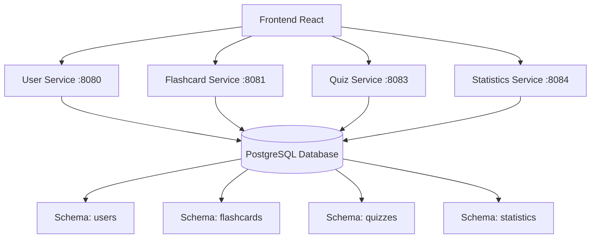
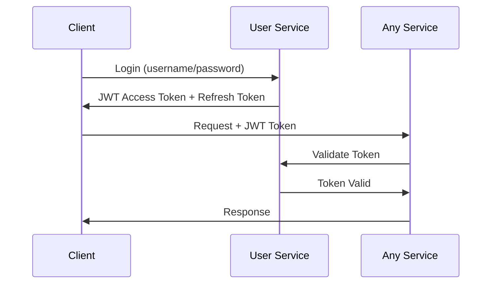

# Prezentacja QuizApp - Przewodnik do Prezentowania

> **Kompletny przewodnik do prezentowania wszystkich aspektów systemu QuizApp**

## O czym będziesz mówić

Ta strona pomoże Ci przeprowadzić prezentację systemu QuizApp, przechodząc krok po kroku przez wszystkie technologie, funkcje i komponenty aplikacji.

---

## 1. Przegląd Projektu

### **Co to jest QuizApp?**
- **Platforma edukacyjna** do tworzenia i rozwiązywania quizów oraz nauki z fiszkami
- **Architektura mikroserwisów** - nowoczesne podejście do budowy aplikacji
- **System grupowy** - wspólna nauka w zespołach
- **Statystyki i analytics** - śledzenie postępów w nauce

### **Główne Funkcjonalności**
1. **Zarządzanie użytkownikami** - rejestracja, logowanie, profile
2. **System fiszek** - tworzenie, edycja, nauka z fiszkami
3. **System quizów** - tworzenie, rozwiązywanie, ocenianie
4. **Grupy uczące** - współpraca zespołowa
5. **Statystyki** - analiza postępów i wyników

---

## 2. Architektura Systemu

### **Architektura Mikroserwisów**



### **Dlaczego Mikroserwisy?**
- **Separacja odpowiedzialności** - każdy serwis ma jedną rolę
- **Skalowalność** - możliwość niezależnego skalowania
- **Niezależne wdrożenia** - aktualizacje bez przestojów
- **Zespołowa praca** - różne zespoły mogą pracować nad różnymi serwisami
- **Różne technologie** - możliwość wyboru najlepszych narzędzi

---

## 3. Stack Technologiczny

### **Frontend**
- **React 18** - nowoczesna biblioteka UI
- **Create React App** - szybki start projektu
- **CSS Modules** - style lokalne do komponentów
- **Axios** - komunikacja z API
- **React Router** - routing w aplikacji SPA

### **Backend - Każdy Mikroserwis**
- **Java 17** - najnowsza wersja LTS
- **Spring Boot 3.x** - framework aplikacyjny
- **Spring Security** - zabezpieczenia i autoryzacja
- **Spring Data JPA** - ORM i dostęp do danych
- **Hibernate** - implementacja JPA
- **Docker** - konteneryzacja serwisów

### **Baza Danych**
- **PostgreSQL 14** - relacyjna baza danych
- **Flyway** - migracje bazy danych
- **Hibernate DDL** - automatyczne tworzenie tabel

### **Bezpieczeństwo**
- **JWT Tokens** - autoryzacja bezstanowa
- **BCrypt** - hashowanie haseł
- **CORS** - polityki cross-origin
- **Rate Limiting** - ochrona przed nadużyciami
- **Anti-Postman** - ochrona przed automatyzacją

### **DevOps & Deployment**
- **Docker Compose** - orkiestracja kontenerów
- **Nginx** (opcjonalnie) - load balancer
- **Monitoring** - healthchecks i logi

---

## 4. Szczegóły Mikroserwisów

### **User Service (Port 8080)**
**Odpowiedzialności:**
- Rejestracja i logowanie użytkowników
- Zarządzanie profilami użytkowników
- System ról (USER, ADMIN)
- Tworzenie i zarządzanie grupami
- Autoryzacja JWT

**Główne Endpointy:**
```
POST /api/auth/register    # Rejestracja
POST /api/auth/login       # Logowanie
GET  /api/users/profile    # Profil użytkownika
POST /api/groups           # Tworzenie grup
GET  /api/groups           # Lista grup
```

**Tabele Bazy:**
- `users` - dane użytkowników
- `roles` - role systemowe
- `user_groups` - grupy użytkowników
- `refresh_tokens` - tokeny odświeżania

---

### **Flashcard Service (Port 8081)**
**Odpowiedzialności:**
- Tworzenie i zarządzanie talii fiszek
- CRUD operacje na fiszkach
- Upload obrazków do fiszek
- Udostępnianie talii grupom

**Główne Endpointy:**
```
GET    /api/flashcard-decks        # Lista talii
POST   /api/flashcard-decks        # Tworzenie talii
GET    /api/flashcard-decks/{id}   # Szczegóły talii
POST   /api/flashcards             # Dodawanie fiszki
POST   /api/flashcards/upload      # Upload obrazka
```

**Tabele Bazy:**
- `flashcard_decks` - talie fiszek
- `flashcards` - pojedyncze fiszki
- `flashcard_deck_groups` - udostępnianie grupom

---

### **Quiz Service (Port 8083)**
**Odpowiedzialności:**
- Tworzenie i zarządzanie quizami
- System pytań wielokrotnego wyboru
- Przeprowadzanie quizów
- Zapisywanie wyników

**Główne Endpointy:**
```
GET    /api/quizzes           # Lista quizów
POST   /api/quizzes           # Tworzenie quizu
GET    /api/quizzes/{id}      # Szczegóły quizu
POST   /api/quizzes/{id}/take # Rozwiązywanie quizu
GET    /api/quiz-results      # Wyniki użytkownika
```

**Tabele Bazy:**
- `quizzes` - definicje quizów
- `quiz_questions` - pytania w quizach
- `quiz_results` - wyniki rozwiązanych quizów
- `quiz_groups` - udostępnianie grupom

---

### **Statistics Service (Port 8084)**
**Odpowiedzialności:**
- Agregacja statystyk użytkowników
- Analiza wyników quizów
- Raporty postępów w nauce
- Statystyki grup

**Główne Endpointy:**
```
GET /api/statistics/user/{id}     # Statystyki użytkownika
GET /api/statistics/quiz/{id}     # Statystyki quizu
GET /api/statistics/group/{id}    # Statystyki grupy
```

**Tabele Bazy:**
- `quiz_statistics` - zagregowane statystyki

---

## 5. Frontend React

### **Struktura Aplikacji**
```
src/
├── components/          # Komponenty wielokrotnego użytku
│   ├── Auth/           # Komponenty autoryzacji
│   ├── Flashcards/     # Komponenty fiszek
│   ├── Quizzes/        # Komponenty quizów
│   └── Groups/         # Komponenty grup
├── pages/              # Strony aplikacji
├── services/           # Serwisy API
├── context/            # Context API
└── utils/              # Narzędzia pomocnicze
```

### **Zarządzanie Stanem**
- **React Context** - globalny stan użytkownika
- **useState/useEffect** - lokalny stan komponentów
- **JWT w localStorage** - trwałość sesji

### **Design System**
- **Responsive Design** - działanie na wszystkich urządzeniach
- **Nowoczesny UI** - czyste, intuicyjne interfejsy
- **Accessibility** - dostępność dla wszystkich użytkowników

---

## 6. Struktura Bazy Danych

### **Architektura Multi-Schema**
```sql
-- 4 oddzielne schematy dla lepszej organizacji
CREATE SCHEMA users;        -- User Service
CREATE SCHEMA flashcards;   -- Flashcard Service  
CREATE SCHEMA quizzes;      -- Quiz Service
CREATE SCHEMA groups;       -- Grupy (część User Service)
```

### **Strategie Tworzenia Tabel**

**1. Hibernate DDL-Auto:**
```ini
# User Service & Statistics Service
spring.jpa.hibernate.ddl-auto=update

# Automatyczne tworzenie/aktualizacja tabel z encji JPA
```

**2. Flyway Migrations:**
```ini
# Quiz Service & Flashcard Service  
spring.jpa.hibernate.ddl-auto=validate
spring.flyway.enabled=true

# Kontrolowane migracje SQL
```

### **Relacje Między Serwisami**
- **User ID** - klucz obcy w innych serwisach
- **Group IDs** - kolekcje identyfikatorów grup
- **Statistics** - agregacja danych z Quiz Service

---

## 7. System Bezpieczeństwa

### **JWT Authentication**


### **Warstwy Zabezpieczeń**

**1. Autoryzacja:**
- JWT tokens z czasem wygaśnięcia
- Refresh tokens dla przedłużenia sesji
- Role-based access control (USER/ADMIN)

**2. Anti-Postman Protection:**
```java
// Ochrona przed automatycznymi requestami
@Component
public class AntiPostmanFilter {
    // Sprawdzanie nagłówków, user-agent, itp.
}
```

**3. Rate Limiting:**
```java
// Ograniczenie liczby requestów na minutę
@RateLimited(maxRequests = 100, windowSize = 60000)
```

**4. CORS Configuration:**
```java
// Kontrola cross-origin requests
@CrossOrigin(origins = {"http://localhost:3000"})
```

---

## 8. Deployment & Docker

### **Docker Compose Architecture**
```yaml
services:
  postgres:          # Baza danych
  user-service:      # Port 8080
  flashcard-service: # Port 8081  
  quiz-service:      # Port 8083
  statistics-service:# Port 8084
  frontend:          # Port 3000
```

### **Dlaczego Docker?**
- **Consistent Environment** - takie same warunki wszędzie
- **Easy Deployment** - `docker-compose up` i gotowe
- **Scalability** - łatwe skalowanie serwisów
- **Development** - szybka konfiguracja środowiska

### **Health Checks**
```yaml
healthcheck:
  test: ["CMD-SHELL", "pg_isready -U postgres"]
  interval: 5s
  timeout: 5s
  retries: 5
```

---

## 9. Monitoring & Observability

### **Metryki Aplikacji**
- **Spring Boot Actuator** - health, metrics, info
- **PostgreSQL Statistics** - wydajność bazy danych
- **HTTP Request Metrics** - czas odpowiedzi, błędy

### **Logging Strategy**
```ini
# Różne poziomy logowania dla różnych komponentów
logging.level.org.springframework.security=DEBUG
logging.level.org.hibernate.SQL=DEBUG
logging.level.com.example.*.security=INFO
```

### **Error Handling**
- **Global Exception Handlers** - spójne obsługiwanie błędów
- **Structured Error Responses** - JSON z kodem błędu
- **Graceful Degradation** - aplikacja działa mimo problemów

---

## 10. Demonstracja Funkcji

### **User Flow - Rejestracja i Logowanie**
1. **Rejestracja** - user-service/register
2. **Logowanie** - otrzymanie JWT token
3. **Profil** - wyświetlenie danych użytkownika
4. **Grupy** - dołączenie/tworzenie grup

### **Flashcard Flow - Nauka z Fiszkami**
1. **Tworzenie Talii** - flashcard-service
2. **Dodawanie Fiszek** - term + definition + obrazek
3. **Udostępnianie Grupie** - collaboration
4. **Tryb Nauki** - przegląd fiszek

### **Quiz Flow - Rozwiązywanie Quizów**
1. **Tworzenie Quizu** - quiz-service
2. **Dodawanie Pytań** - multiple choice
3. **Rozwiązywanie** - timed quiz
4. **Wyniki** - score i statistics

### **Analytics Flow - Statystyki**
1. **Statystyki Osobiste** - postępy użytkownika
2. **Statystyki Grupy** - ranking, średnie
3. **Analiza Quizów** - trudność pytań
4. **Raporty** - eksport danych

---

## 11. Punkty Prezentacyjne

### **Co Wyróżnia Ten Projekt?**

**Architektura:**
- ✅ Mikroservisy z rzeczywistym podziałem odpowiedzialności
- ✅ Skalowalna architektura gotowa na produkcję
- ✅ Docker deployment z health checks

**Technologie:**
- ✅ Najnowsze technologie (Java 17, Spring Boot 3, React 18)
- ✅ Nowoczesne praktyki bezpieczeństwa
- ✅ Clean code i SOLID principles

**Bezpieczeństwo:**
- ✅ JWT authentication z refresh tokens
- ✅ Multi-layer security (Rate limiting, Anti-automation)
- ✅ Role-based access control

**Dane:**
- ✅ Multi-schema database design
- ✅ Hybryda Hibernate DDL + Flyway migrations
- ✅ Statystyki i analytics

**UX/UI:**
- ✅ Responsive design
- ✅ Intuitive user interface
- ✅ Real-time feedback

---

## 12. Uruchomienie Demonstracji

### **Quick Start**
```bash
# 1. Sklonowanie repo
git clone <repository-url>
cd QuizApp

# 2. Uruchomienie całego stacku
docker-compose up -d

# 3. Sprawdzenie statusu
docker-compose ps

# 4. Otworzenie aplikacji
open http://localhost:3000
```

### **Testowanie API**
```bash
# Health check wszystkich serwisów
curl http://localhost:8080/actuator/health  # User Service
curl http://localhost:8081/actuator/health  # Flashcard Service  
curl http://localhost:8083/actuator/health  # Quiz Service
curl http://localhost:8084/actuator/health  # Statistics Service
```

### **Monitoring Dashboard**
- **Frontend:** http://localhost:3000
- **API Docs:** http://localhost:8080/swagger-ui.html
- **Database:** localhost:5432 (postgres/postgres)

---

## 13. Dodatkowe Materiały

### **Linki do Sekcji Dokumentacji**
- **[Szczegóły Mikroserwisów](./SERVICES.md)** - głęboki dive w każdy serwis
- **[API Endpoints](./API_ENDPOINTS.md)** - pełna dokumentacja API
- **[Schema Bazy Danych](./DATABASE_SCHEMA.md)** - struktura tabel
- **[Bezpieczeństwo](./SECURITY.md)** - strategie zabezpieczeń

### **Pytania od Publiczności**
Przygotuj się na pytania o:
- **Dlaczego mikroservisy?** - skalowalność, maintainability
- **Jak działa bezpieczeństwo?** - JWT, role, rate limiting
- **Jak skalujesz bazę danych?** - schema separation, connection pooling
- **Jak wdrażasz na produkcję?** - Docker, CI/CD, monitoring
- **Jak obsługujesz błędy?** - circuit breakers, graceful degradation

---

## 14. Checklist Prezentacji

### **Przed Prezentacją:**
- [ ] Uruchom `docker-compose up -d`
- [ ] Sprawdź wszystkie health checks
- [ ] Utwórz przykładowe konta użytkowników
- [ ] Przygotuj przykładowe fiszki i quizy
- [ ] Wygeneruj przykładowe statystyki
- [ ] Otwórz wszystkie potrzebne karty w przeglądarce

### **Podczas Prezentacji:**
- [ ] Zacznij od overview i problemu biznesowego
- [ ] Pokaż architekturę na diagramie
- [ ] Zademonstruj każdą funkcjonalność live
- [ ] Wyjaśnij bezpieczeństwo na konkretnych przykładach
- [ ] Pokaż monitoring i logi
- [ ] Zademonstruj deployment

### **Kluczowe Punkty do Podkreślenia:**
1. **Rzeczywista architektura mikroservisów** (nie monolith z wieloma portami)
2. **Przemyślane bezpieczeństwo** (nie tylko basic auth)
3. **Skalowalna struktura bazy** (schema separation)
4. **Production-ready deployment** (Docker, health checks)
5. **Nowoczesny tech stack** (najnowsze wersje)

---

> **Tip:** Używaj tej strony jako ściągawki podczas prezentacji - każda sekcja to kolejny slajd do omówienia! 